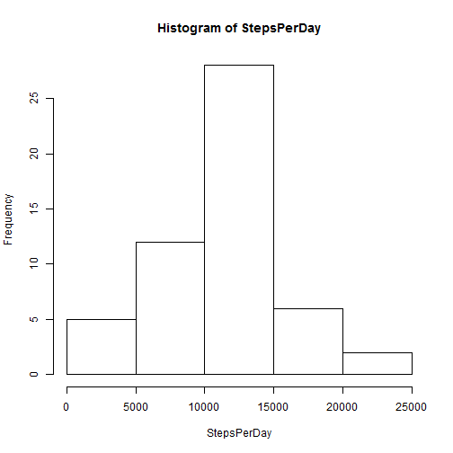
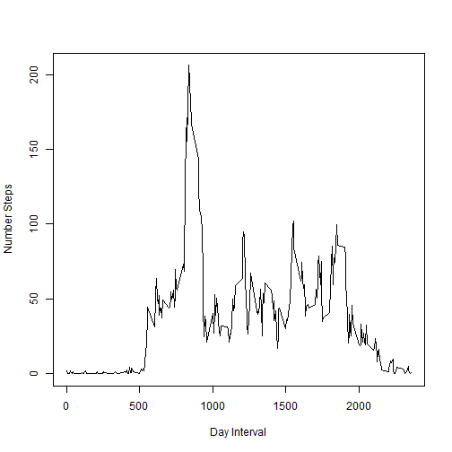
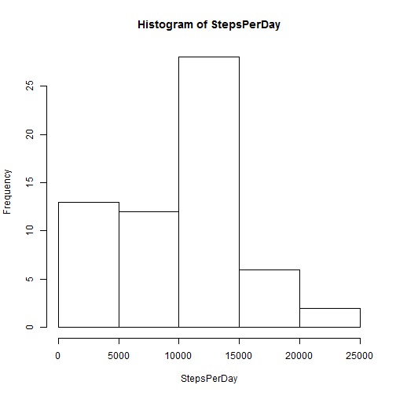
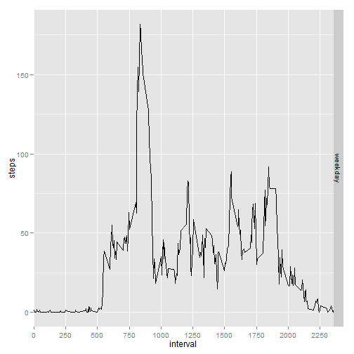

<br>

## Loading and preprocessing the data


```r
url <- "http://d396qusza40orc.cloudfront.net/repdata/data/activity.zip"
file <- "activity.zip"
download.file(url,file)
unzip(file)
file <- "activity.csv"
RawData <- read.table(file, TRUE, sep = ",")
OmitNAData <- na.omit(RawData)
```
<br>

## What is mean total number of steps taken per day?


```r
# sum steps per day and omit NA (some days all steps are NA)
StepsPerDay <- tapply(OmitNAData$steps, OmitNAData$date, sum)
# vector with days
Days <- names(StepsPerDay)
# convert StepsPerDay data object into vector
StepsPerDay <- as.vector(StepsPerDay)
# add days as names of StepsPerDay vector elements
names(StepsPerDay) <- Days
# in StepsPerDay vector there are NAs - some days had only NAs, for example:
# which(!is.na(RawData[which(RawData$date == "2012-11-10"),]$steps))
# remove NAs of StepsPerDay
StepsPerDay <- na.omit(StepsPerDay)
# build histogram
hist(StepsPerDay)
```

 

Mean steps per day


```r
mean(StepsPerDay, na.rm = TRUE)
```

```
## [1] 10766.19
```

Median steps per day


```r
median(StepsPerDay, na.rm = TRUE)
```

```
## [1] 10765
```
<br>

## What is the average daily activity pattern?


```r
# convert OmitNAData$interval into factor
OmitNAData$interval <- as.factor(OmitNAData$interval)
# average number of steps taken, averaged across all days
AverageStepsDayInterval <- tapply(OmitNAData$steps, OmitNAData$interval, mean)
# time series plot of the interval (x-axis) and the average number of steps taken
plot(names(AverageStepsDayInterval), AverageStepsDayInterval, type = 'l', 
     xlab = "Day Interval", ylab = "Number Steps")
```

 

The 5-minute interval, on average across all the days in the dataset, that contains the maximum number of steps


```r
# the 5-minute interval with the maximum number of steps (on average)
max <- AverageStepsDayInterval[
        which(max(AverageStepsDayInterval)==AverageStepsDayInterval)]
# the 5-minute interval is:
names(max)
```

```
## [1] "835"
```
<br>

## Imputing missing values

The total number of missing values in the dataset (i.e. the total number of rows with NAs)


```r
# calculate number of missing values
length(which(is.na(RawData$steps) == TRUE))
```

```
## [1] 2304
```

We devised a strategy for filling in all of the missing values in the dataset: using the median for that 5-minute interval across all days. The new dataset is equal to the original dataset but with the missing data filled in.


```r
# calculate median per day interval
MedianStepsDayInterval <- tapply(OmitNAData$steps, OmitNAData$interval, median)
# intervals that need to be replaced
interval <- RawData$interval[which(is.na(RawData$steps) == TRUE)]
# a copy of the raw data
CopyRawData <- RawData
# replacing NAs with median
RawData$steps[which(is.na(RawData$steps) == TRUE)] <-  
    sapply(interval, function(x, y){
        y[which(names(y) == x)]
    }, y = MedianStepsDayInterval)
# the processed dataset
TidyData <- RawData
# the raw data
RawData <- CopyRawData
```

Make a histogram of the total number of steps taken each day


```r
# do same steps as in Question 1 with the TidyData
StepsPerDay <- tapply(TidyData$steps, TidyData$date, sum)
Days <- names(StepsPerDay)
StepsPerDay <- as.vector(StepsPerDay)
names(StepsPerDay) <- Days
# build histogram
hist(StepsPerDay)
```

 

Calculate and report the mean total number of steps taken per day


```r
# calculate mean 
mean(StepsPerDay, na.rm = TRUE)
```

```
## [1] 9503.869
```

Calculate and report the median total number of steps taken per day


```r
# calculate median
median(StepsPerDay, na.rm = TRUE)
```

```
## [1] 10395
```

We see these values differ from the estimates from the first part. The impact of imputing missing data on the estimates of the total daily number of steps is decreasing the mean and median.

<br>

## Are there differences in activity patterns between weekdays and weekends?

Create a new factor variable in the dataset with two levels - "weekday" and "weekend" indicating whether a given date is a weekday or weekend day.


```r
# add to tidy dataset the weekdays
TidyData$WeekDays <- weekdays(as.Date(TidyData$date))
# add to tidy dataset the day type: weekend or weekday
TidyData$TypeDay <- sapply(TidyData$WeekDays, function(x,y){
          if(x %in% y) "weekend"
          else "weekday"
      }, y = c("sábado", "domingo")) # Sábado, Domingo means Saturday, Sunday in Spanish
# transform the day type to factor
TidyData$TypeDay <- as.factor(TidyData$TypeDay)
```

Make a panel plot containing a time series plot (i.e. type = "l") of the 5-minute interval (x-axis) and the average number of steps taken, averaged across all weekday days or weekend days (y-axis).


```r
# create new factor "interval_TypeDay" for doing analysis
TidyData$interval_TypeDay <- mapply(function(x,y){
  paste(x,y,sep = "_")}, x = TidyData$interval, y = TidyData$TypeDay)
# average number of steps taken, averaged across all days
AverageStepsDayIntervalTypeDay <- tapply(TidyData$steps, 
                                  as.factor(TidyData$interval_TypeDay), mean)
# get names
Interval_TypeDay <- names(AverageStepsDayIntervalTypeDay)
# break vector interval_typeDay into two separate vectors interval and dayType
Interval <- as.numeric(gsub("_.*","", Interval_TypeDay))
TypeDay <- gsub(".*_","", Interval_TypeDay)
# build data frame
df <- data.frame(steps = unname(AverageStepsDayIntervalTypeDay), interval = Interval,
                 typeDay = TypeDay)
# load ggplot2 package
library(ggplot2)
# do the plot
p <- ggplot(df, aes(x=interval, y=steps)) + facet_grid(typeDay ~ .)
p + geom_line(aes(group=typeDay)) + scale_x_discrete(breaks = seq(0,2355, by = 250))
```

 
